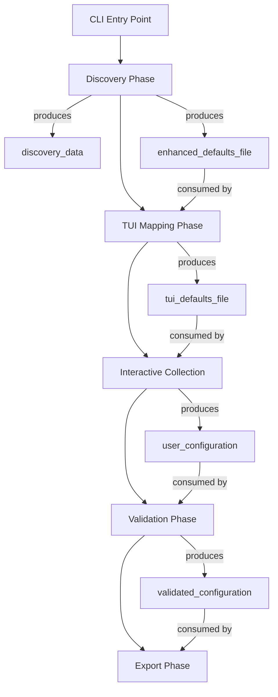
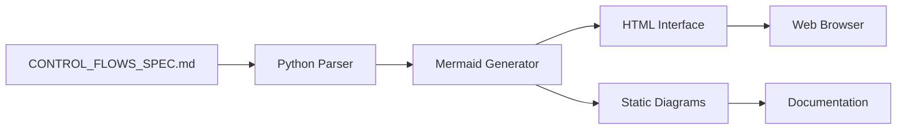

# Control Flow Visualizer - Mermaid Integration

## Why Mermaid.js is Perfect for OpenProject Control Flows

### 1. **YAML-Native Syntax**
Your existing CONTROL_FLOWS_SPEC.md can be easily converted to Mermaid diagrams:



### 2. **Multiple Diagram Types**
- **Flowcharts**: Sequential process flows
- **State Diagrams**: System state transitions  
- **Gantt Charts**: Timeline and scheduling
- **Sequence Diagrams**: Component interactions

### 3. **Zero Dependencies**
- Renders directly in browsers via CDN
- No build process required
- Works offline once loaded

### 4. **Interactive Capabilities**
- Click events on nodes
- Zoom and pan
- Responsive design
- Custom styling

## Implementation Strategy

### Phase 1: Basic Flow Generation ✅
- Parse CONTROL_FLOWS_SPEC.md
- Generate basic flowcharts
- Static HTML output

### Phase 2: Interactive Interface ✅
- Web server for live updates
- Multiple visualization types
- Tabbed interface

### Phase 3: Advanced Features
- Click-to-navigate flows
- Real-time status updates
- Integration with implementation tracking

## Technical Architecture



### Components
1. **ControlFlowVisualizer**: Main parser and generator class
2. **MermaidGenerator**: Converts flow data to Mermaid syntax
3. **WebServer**: Serves interactive interface
4. **Templates**: HTML/CSS for visualization

## Integration Points

### With Control Flow Manager
```python
from control_flow_engine import ControlFlowManager

manager = ControlFlowManager()
manager.generate_visualization()  # Creates diagrams
manager.serve_visualizer()        # Starts web interface
```

### With CLI
```bash
flow-engine visualize --type overview
flow-engine serve --port 8080
```

### With Documentation
- Auto-generate diagrams for README files
- Include in technical documentation  
- Export for presentations

## Benefits Realized

1. **🎯 Design-First Visualization**: See flows before implementation
2. **📊 Progress Tracking**: Visual status of implementation phases  
3. **🤝 Communication**: Share designs with stakeholders
4. **🔍 Debugging**: Understand complex flow interactions
5. **📚 Documentation**: Auto-generated visual documentation

## Future Enhancements

- **Live Data Integration**: Show real execution traces
- **Performance Metrics**: Visualize timing and bottlenecks
- **Error Flow Tracking**: Highlight error paths and recovery
- **Multi-Component Views**: Show flows across all repositories

---

*Analysis completed: October 2025*
*Status: Successfully implemented and integrated*