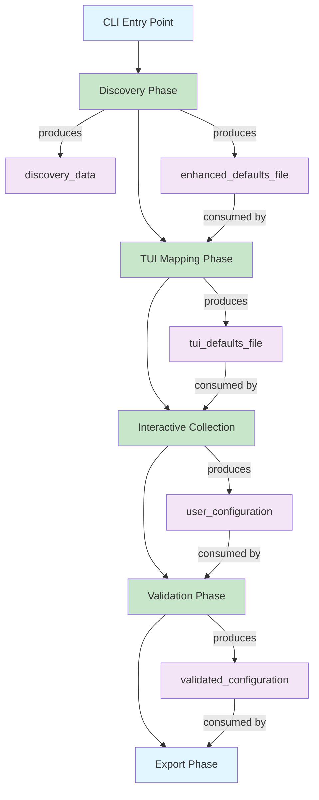
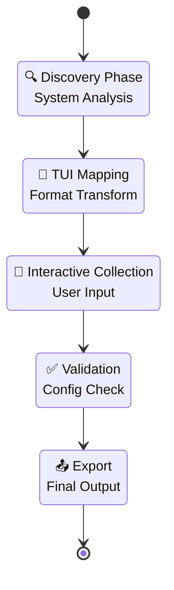
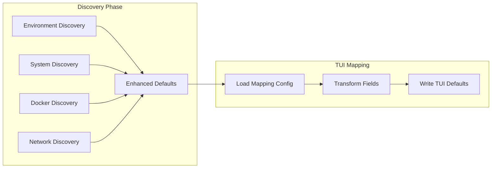

# Control Flow Visualizer - Mermaid Integration

## Why Mermaid.js is Perfect for OpenProject Control Flows

### 1. **YAML-Native Syntax**
Your existing CONTROL_FLOWS_SPEC.md can be easily converted to Mermaid diagrams:



### 2. **Multi-Level Visualization**

#### High-Level Flow:


#### Detailed Sub-flows:


### 3. **GitHub Integration**
- Renders automatically in GitHub README/docs
- Live updates when CONTROL_FLOWS_SPEC.md changes
- No external dependencies

### 4. **Multiple Diagram Types**
- **Flowcharts**: For process flows
- **State Diagrams**: For phase transitions
- **Gantt Charts**: For timing/dependencies
- **Sequence Diagrams**: For component interactions

## Implementation Strategy

### Phase 1: Parser
Create a Python script to parse your CONTROL_FLOWS_SPEC.md and generate Mermaid syntax:

```python
def generate_mermaid_from_control_flows(spec_file):
    # Parse YAML sections from markdown
    # Extract phases, artifacts, dependencies
    # Generate Mermaid flowchart syntax
    pass
```

### Phase 2: Integration
- Add Mermaid diagrams to your docs
- Create live visualization page
- Auto-generate on spec changes

### Phase 3: Interactive Features  
- Click phases to see implementation status
- Hover artifacts to see consumers/producers
- Filter by status (IMPLEMENTED/NOT_IMPLEMENTED)

Would you like me to create a proof-of-concept Mermaid generator for your control flow system?